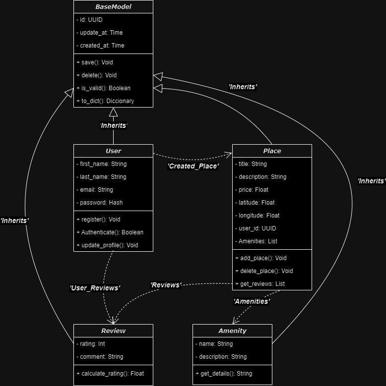

# 🌟 HBnB Technical Document

This technical document outlines the architecture and design of the **HBnB Project**, providing a clear and comprehensive reference for all implementation phases. It includes class and sequence diagrams, detailed interactions, and design rationale to guide the development process.

---

## 📑 Table of Contents

1. [Introduction](#introduction)
2. [High-Level Architecture](#high-level-architecture)
3. [Business Logic Layer](#business-logic-layer)
4. [API Interaction Flow](#api-interaction-flow)
5. [Final Notes](#final-notes)

---

## 📖 Introduction

The **HBnB Project** is a layered system designed to manage users, places, and reviews. This document serves as a detailed blueprint for the system, offering insights into its structure, components, and data flow.

---

## 🏗️ High-Level Architecture

### Package Diagram

The system follows a **Facade Pattern** to encapsulate the complexity of the Business Logic Layer and Persistence Layer behind a simple API. Below is the high-level package diagram illustrating this structure.

---

## 🧩 Business Logic Layer

### Class Diagram

This diagram showcases the main classes in the Business Logic Layer, their relationships, and key methods. These classes form the foundation for the system's core functionality.

---

## 🔄 API Interaction Flow

This section contains sequence diagrams that illustrate the step-by-step interaction between the **Presentation**, **Business Logic**, and **Persistence** layers for different API calls.

### 1️⃣ User Registration
When a user registers for the platform, the following sequence of operations occurs:

---

### 2️⃣ Place Creation
This diagram shows how a user creates a new place listing in the system:

---

### 3️⃣ Review Submission
A user submits a review for a place. The diagram illustrates the process from request to database storage:

---

### 4️⃣ Fetching a List of Places
When a user requests a list of places based on certain criteria, the following sequence occurs:

---

## 📝 Final Notes

This document was created to serve as a **comprehensive guide** for the development of the HBnB system. It combines high-level architecture, business logic design, and interaction flows to ensure a smooth implementation process.

---

### 📌 Key Points:
- Maintain consistency across all layers of the system.
- Use this document as a **reference** during the development and testing phases.
- If any issues or discrepancies are found, please report them to the development team.

---

> **Note:** For any questions or clarifications, feel free to contact the project maintainers. Contributions to improve this document are always welcome!
